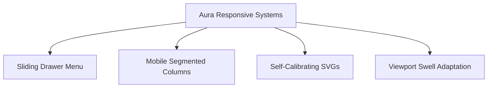

# Aura | Personal Productivity Sanctuary 🌌

**Aura** is a premium, glassmorphic single-page web application designed to enhance deep focus, structure task management, and track mental well-being. Built entirely with high-performance vanilla HTML, CSS, and JavaScript, it runs locally without external database or asset dependencies.

## 🔗 Access the Application

The application is running live on your local machine:
👉 **[http://127.0.0.1:3000](http://127.0.0.1:3000)**

---

## 🛠️ File Structure

The project has been initialized in your workspace:
*   📂 [index.html](file:///C:/Users/NETCOM/agy-cli-projects/index.html) — Structural markup, modals, custom sliders, overlays, and mobile tabs.
*   📂 [styles.css](file:///C:/Users/NETCOM/agy-cli-projects/styles.css) — Design system, glassmorphism filters, responsive grid layout, and sliding drawer transitions.
*   📂 [app.js](file:///C:/Users/NETCOM/agy-cli-projects/app.js) — Keyboard hotkeys, task controller, local storage sync, Pomodoro countdown, and Web Audio API engine.
*   📂 [package.json](file:///C:/Users/NETCOM/agy-cli-projects/package.json) — Configuration for server running on port 3000.

---

## ⚡ Mobile & Responsive UI/UX Systems

### 1. Sliding Mobile Menu Drawer 📱
*   On screens `< 768px`, the sidebar slides off-screen (`transform: translateX(-100%)`).
*   A hamburger button is pinned floating on the top-left of the viewport.
*   Toggling it slides the sidebar drawer in from the left and activates a glassmorphic `.sidebar-overlay` mask that dims the background.
*   Selecting any tab closes the drawer automatically.

### 2. Segmented Kanban Column Tabs 📑
*   Stacking three long columns vertically on mobile screens results in scrolling fatigue.
*   To solve this, Aura switches to a **segmented tab control** on mobile (`To Do` | `In Progress` | `Completed`).
*   Only the active column is rendered, keeping the viewport clean.

### 3. Self-Calibrating Progress Rings 📐
*   Rather than hardcoding circle stroke offsets (circumference: $2 \pi r$), Aura reads geometry attributes dynamically (`baseVal.value`).
*   Whether the timer circle scale shrinks to $r=100$ on mobile or stays at $r=120$ on desktop, the progress rings animate smoothly.

---

## ⌨️ Desktop Keyboard Shortcuts
*   <kbd>Alt</kbd> + <kbd>B</kbd> — Expand / collapse sidebar (desktop) or slide drawer (mobile).
*   <kbd>Alt</kbd> + <kbd>1</kbd> — Switch to **Dashboard** tab.
*   <kbd>Alt</kbd> + <kbd>2</kbd> — Switch to **Tasks** tab.
*   <kbd>Alt</kbd> + <kbd>3</kbd> — Switch to **Pomodoro** tab.
*   <kbd>Alt</kbd> + <kbd>4</kbd> — Switch to **Journal** tab.
*   <kbd>Spacebar</kbd> — Start / Pause Pomodoro timer.
*   <kbd>Alt</kbd> + <kbd>R</kbd> — Reset Pomodoro timer.

---

> [!TIP]
> Keep the server running in the background. If you want to stop the server at any time, run: `manage_task kill` on task id `6b284218-b68c-4df8-b633-5aca70fd92a5/task-84`.
