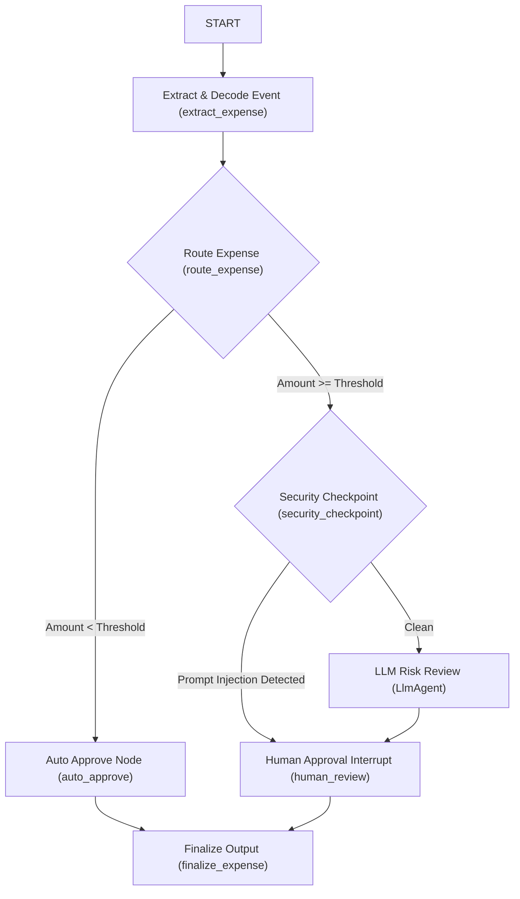

# Refactoring to Ambient Expense-Approval Agent with Security Checkpoint

This plan details the addition of a security checkpoint in the Graph Workflow before the LLM reviewer to scrub PII and detect prompt injection attempts.

## User Review Required

> [!IMPORTANT]
> - A new function node `security_checkpoint` is added between `route_expense` above-threshold branch and `risk_reviewer`.
> - It scrubs SSNs and Credit Card numbers from the expense description and stores any redacted categories.
> - It identifies prompt injection attempts in the description and routes them directly to human review, flagging them as a high-risk security event.
> - The final `ExpenseOutput` is updated to include a `redacted_categories` field.

## Proposed Graph Topology

## Proposed Changes

### Agent Implementation

#### [MODIFY] [agent.py](file:///c:/Users/NETCOM/Desktop/Vibe%20Coding/ambient-expense-agent/expense_agent/agent.py)
- Import `re` module for regex support.
- Add helper functions `scrub_pii(description)` and `detect_prompt_injection(description)`.
- Implement `security_checkpoint(ctx, node_input)` node.
- Update `ExpenseOutput` model to include `redacted_categories`.
- Update `human_review` to display redacted categories if present.
- Update `finalize_expense` to populate `redacted_categories`.
- Update `edges` topology to include the new security checkpoint routes.

---

## Verification Plan

### Automated Tests
- Run `agents-cli lint` to check for formatting and import issues.

### Manual Verification
- Run smoke tests with `agents-cli run` using:
  1. Plain description under threshold (auto-approve).
  2. Description with SSN/Credit Card above threshold (should redact and proceed to LLM/human).
  3. Description with prompt injection attempts (should bypass LLM, flag as security event, and go directly to human).
