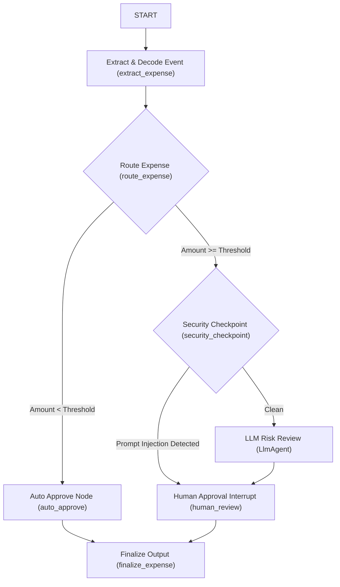

# Walkthrough: Ambient Expense-Approval Agent (ADK 2.0)

We have successfully migrated the template to a graph-based **ADK 2.0 Workflow**, structured the code in the `expense_agent/` package namespace, set up local configuration/authentication, implemented a PII scrubbing and prompt injection security checkpoint, and verified the project.

## Changes Made

1. **Reconfigured Layout**: Re-routed `agents-cli-manifest.yaml` and `pyproject.toml` to point to the new `expense_agent` package name.
2. **Setup config.json**: Set up a local config specifying the threshold and the `gemini-3.1-flash-lite` model.
3. **Setup .env**: Created a `.env` template supporting both Google AI Studio keys and Google Cloud SDK (`gcloud`) authentication.
4. **Graph Workflow Implementation**: Refactored `expense_agent/agent.py` to use `Workflow`, function nodes, conditional edges, and human-in-the-loop `RequestInput` interrupts.
5. **PII & Prompt Injection Security Checkpoint**: Added a `security_checkpoint` node that scrubs SSNs/Credit Cards and bypasses the LLM reviewer if prompt injection is detected.

---

## Graph Topology: Step-by-Step

1. **`extract_expense`**: Reads the incoming payload. If the `"data"` key contains a base64-encoded string, it decodes it; otherwise, it parses plain JSON.
2. **`route_expense`**: Checks if the amount is less than the `$100` threshold.
3. **`auto_approve`**: If under `$100`, auto-approves immediately without calling the LLM.
4. **`security_checkpoint`**: If `$100` or more:
   - Scrubs SSNs and Credit Card numbers from the `description`.
   - Remembers redacted categories (e.g. `["SSN", "Credit Card"]`) in the context state.
   - Detects prompt injection keywords. If detected, it bypasses the LLM and routes straight to human review, flagging it as a security event.
5. **`risk_reviewer` (`LlmAgent`)**: If clean, calls `gemini-3.1-flash-lite` to review the expense for risk factors.
6. **`human_review`**: Pauses execution using `RequestInput` to wait for a human approval response (`yes`/`no`), showing the scrubbed description and risk assessment.
7. **`finalize_expense`**: Combines the original expense details, approval decision, and redacted categories into a structured `ExpenseOutput` object.

---

## Verifying the Human-in-the-Loop Flow in the Playground

The playground web UI is running locally at:
👉 **[http://127.0.0.1:8080/dev-ui/?app=expense_agent](http://127.0.0.1:8080/dev-ui/?app=expense_agent)**

To observe and interact with the human-in-the-loop flow:
1. Open the URL in your web browser.
2. Under the **Session** panel, you will see the active run initiated by the command we triggered.
3. The graph will show the flow has paused on the `human_review` node.
4. The UI will display the **RISK ALERT** message showing the risk assessment and prompting:
   > **Approve this expense? (yes/no)**
5. Type `yes` or `no` in the input box and click **Send**.
6. The workflow will resume, complete the `finalize_expense` step, and return the structured JSON output showing the outcome.
